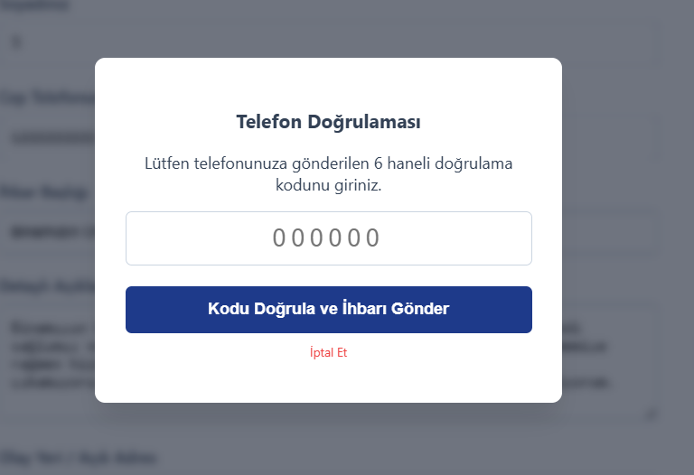

# Belediye İhbar Sistemi

**TR**

Vatandaşların belediye ile ilgili karşılaştıkları sorunları internet üzerinden hızlı ve kolay bir şekilde iletebildikleri, belediye personelinin ise bu bildirimleri yönetim paneli üzerinden takip edip kontrol edebildiği ve çözüme kavuşturabildiği web tabanlı bir sistem.

**EN**

A web-based platform that allows citizens to report municipal issues online quickly and easily, while enabling city staff to track, manage, and resolve these requests through an admin dashboard.

---

## Ekran Görüntüleri  / Screenshots  

### Vatandaş Paneli

<h3 align="center">SMS ile Telefon Doğrulaması</h3>

  

### Admin Login

### Admin Paneli

---
## Amaçlar / Objectives
**TR**
- Vatandaşların belediyeye ulaştırdığı ihbarları tek bir sistem üzerinden toplamak
- Telefon doğrulaması ile sahte ve asılsız ihbarların önüne geçmek
- İhbar sürecini takip koduyla şeffaf hale getirmek
- Belediye personelinin ihbarları tek bir panelden yönetip hızlı şekilde sonuçlandırmasını sağlamak
- Kağıt üzerinde veya sözlü yapılan ihbar süreçlerini dijitalleştirmek

**EN**
- Bring citizen complaints and reports together in one place
- Reduce fake or spam reports with phone number verification
- Make the reporting process transparent with a tracking code
- Let municipal staff manage and resolve reports from a single panel
- Move paper-based and verbal reporting processes online

---

