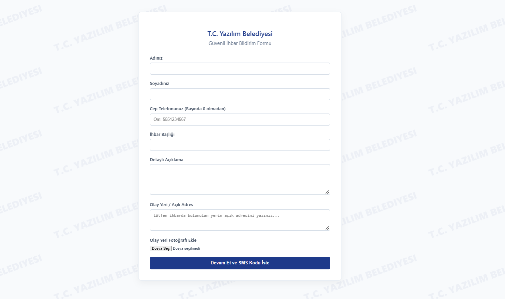
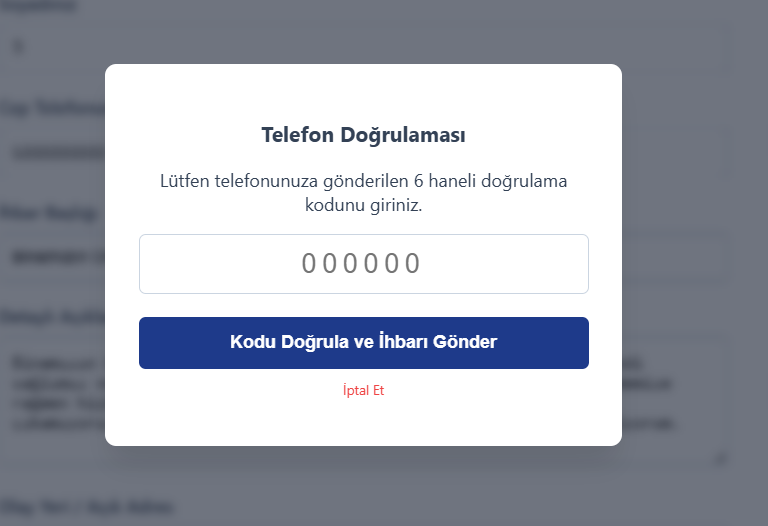
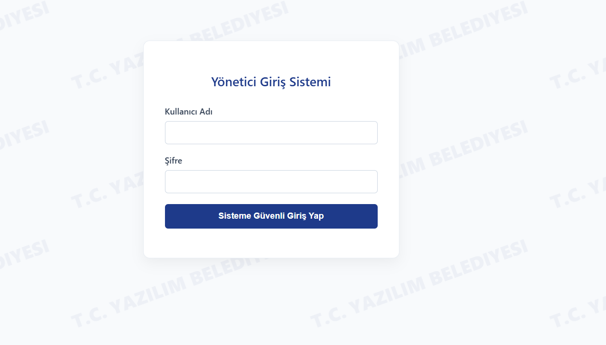
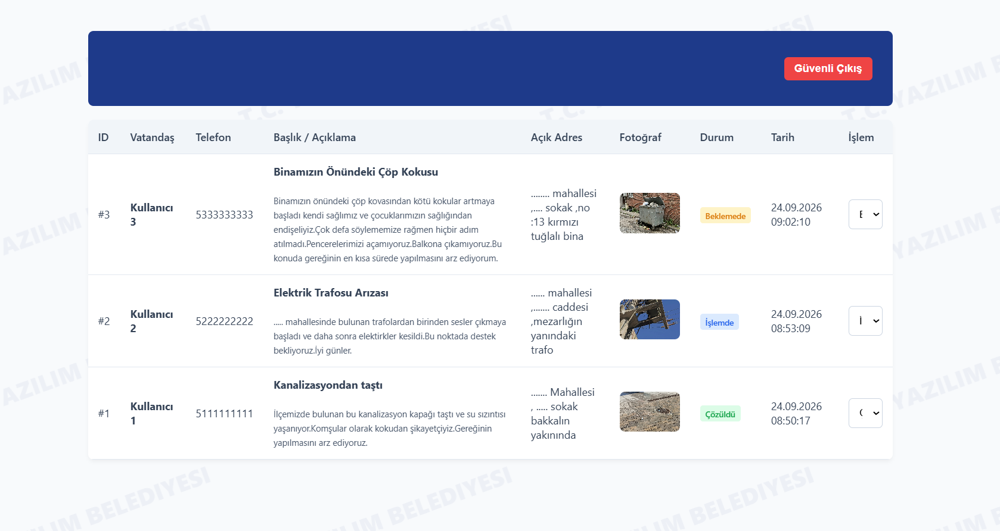

# Belediye İhbar Sistemi

**TR**

Vatandaşların belediye ile ilgili karşılaştıkları sorunları internet üzerinden hızlı ve kolay bir şekilde iletebildikleri, belediye personelinin ise bu bildirimleri yönetim paneli üzerinden takip edip kontrol edebildiği ve çözüme kavuşturabildiği web tabanlı bir sistem.

**EN**

A web-based platform that allows citizens to report municipal issues online quickly and easily, while enabling city staff to track, manage, and resolve these requests through an admin dashboard.

---

## Amaçlar / Objectives
**TR**
- Vatandaşların belediyeye ulaştırdığı ihbarları tek bir sistem üzerinden toplamak
- Telefon doğrulaması ile sahte ve asılsız ihbarların önüne geçmek
- İhbar sürecini takip koduyla şeffaf hale getirmek
- Belediye personelinin ihbarları tek bir panelden yönetip hızlı şekilde sonuçlandırmasını sağlamak
- Kağıt üzerinde veya sözlü yapılan ihbar süreçlerini dijitalleştirmek

**EN**
- Bring citizen complaints and reports together in one place
- Reduce fake or spam reports with phone number verification
- Make the reporting process transparent with a tracking code
- Let municipal staff manage and resolve reports from a single dashboard
- Move paper-based and verbal reporting processes online

---

## Ekran Görüntüleri  / Screenshots  

### Vatandaş Paneli


<h3 align="center">SMS ile Telefon Doğrulaması</h3>

<p align="center">
  
</p>

### Admin Login


### Admin Paneli


---

## Teknolojiler / Technologies

* **Node.js** — Backend çalışma ortamı
* **Express.js** — Web sunucusu ve API
* **SQLite** — Veritabanı yönetimi
* **JavaScript** — Uygulama mantığı ve etkileşimler
* **HTML5** — Kullanıcı arayüzünün yapısı
* **CSS3** — Arayüz tasarımı ve stillendirme
* **express-session** — Oturum yönetimi ve kimlik doğrulama
* **Multer** — Dosya ve fotoğraf yükleme
* **Body Parser** — HTTP istek verilerinin işlenmesi

---

## Proje Yapısı / Project Structure

```text
belediye-ihbar-sistemi/
├── assets/                 # Project screenshots
│   ├── admin_login.png
│   ├── admin_paneli.png
│   ├── sms_dogrulama.png
│   └── vatandas_ekrani.png
│
├── public/                 # Frontend files
│   ├── css/
│   │   └── style.css
│   ├── js/
│   │   └── app.js
│   ├── admin.html
│   ├── dashboard.html
│   └── index.html
│
├── database.js             # Database configuration and operations
├── server.js               # Backend server and API
├── package.json            # Project dependencies and scripts
├── package-lock.json
├── .gitignore
└── README.md
```
---

## Gereksinimler / Requirements

Projeyi çalıştırmadan önce şunların kurulu olduğundan emin olun:

* Node.js (npm dahil)
* Git (depoyu klonlamak için)

---

## Kurulum / Installation

### 1. Depoyu Klonlayın

```bash
git clone https://github.com/enesacarq/belediye-ihbar-sistemi.git
cd belediye-ihbar-sistemi
```

### 2. Bağımlılıkları Yükleyin

```bash
npm install
```

Bu komut, `package.json` içinde listelenen tüm bağımlılıkları otomatik olarak yükler.

### 3. Uygulamayı Başlatın

```bash
node server.js
```

### 4. Uygulamayı Açın

Tarayıcınızdan şu adrese gidin:

```text
http://localhost:3000
```
---

## License
[MIT](https://choosealicense.com/licenses/mit/)